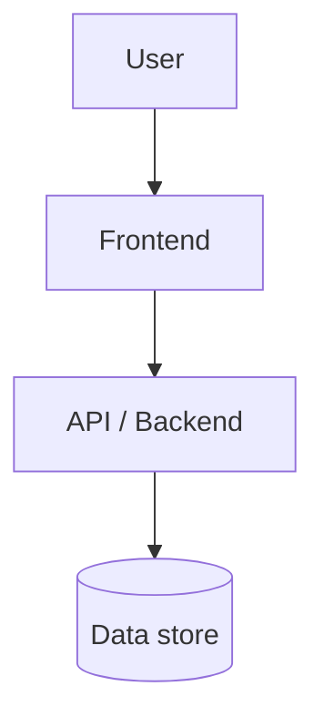

# Create Architecture

## Required architecture template

```markdown
# Architecture — <system/feature>

## Scope
- Covered system/feature.
- Non-goals.

## Current structure
- `<path>` — responsibility.
- Important dependencies and ownership.

## Stack
| Layer | Current / proposed choice | Reason | Alternatives rejected |
|---|---|---|---|
| Frontend | <framework/library> | <why> | <alternatives> |
| Backend/API | <framework/runtime> | <why> | <alternatives> |
| Data/storage | <database/cache/blob/etc.> | <why> | <alternatives> |
| Infra/deploy | <platform/hosting/queue/etc.> | <why> | <alternatives> |

## Target structure
- Modules and boundaries.
- Data/control flow.
- Required Mermaid diagram when architecture spans more than one module/service.



## Contracts
- Public APIs, schemas, events, side effects, and invariants.

## Cost / operations estimate
| Area | Approx cost / complexity | Notes |
|---|---:|---|
| Runtime/hosting | <low/medium/high or €/month estimate> | <assumptions> |
| Database/storage | <low/medium/high or €/month estimate> | <assumptions> |
| Third-party APIs | <low/medium/high or €/month estimate> | <usage assumptions> |
| Maintenance | <low/medium/high> | <operational burden> |

State assumptions clearly. Use rough ranges when exact prices are unknown.

## Risks
- Coupling, migration hazards, testing impact, security/privacy, scaling limits, vendor lock-in, cost surprises.

## Decisions
- Decision.
- Reason.
- Alternatives rejected.

## Verification plan
- Architecture checks, tests, migration checks, load/perf checks, or manual review needed.
```
